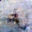

# Diffusion 

Generate images using a simple diffusion model with CIFAR-10

## 📁 Project Structure
```text
diffusion_project/
├── configs/
│   └── default.yaml            # Configuration file for training and sampling
├── data/
│   └── prepare_dataset.py      # Downloaded CIFAR and transform it 
├── models/
│   └── unet.py                 # UNet model definition used in diffusion
├── diffusion/
│   ├── scheduler.py            # Beta scheduler for noise levels
│   └── diffusion.py            # Diffusion process (forward + reverse)
├── train.py                    # Main training script
├── sample.py                   # Image sampling script using trained model
├── utils/
│   └── visualizer.py           # Utility to save generated images
├── samples/                    # Directory to store generated images
├── checkpoints/                # Directory to save model checkpoints
├── requirements.txt            # Python package dependencies
└── README.md                   # Project overview and instructions
```
## ✅ Inferences
1. You can run inference using intermediate checkpoints during training.
2. tqdm provides a more intuitive view of the training progress with a visual progress bar.

## 🚀 How to Run
```bash
# train model
python train.py
# sample images
python sample.py
```

## Concept
### 1. noise process (Train)

```python
 return sqrt_alpha_bar * x_start + sqrt_one_minus_alpha_bar * noise
 ```
 
 Gradually adds noise to the input image, making it resemble random noise over time.
Since this is a linear operation, the image at timestep t can be computed directly from x₀ without iterating through all previous steps.  
<br>

### 2. denoise process (Inference)

```python
 mean = sqrt_recip_alpha * (x_t - betas / sqrt_one_minus_alpha_bar * predicted_noise) # at def p_sample()

for t in tqdm(reversed(range(self.timesteps)), desc="Sampling"): # at def sampple(), repeat a denoise step
    t_tensor = torch.full((batch_size,), t, device=self.device, dtype=torch.long)
    x = self.p_sample(x, t_tensor)

 ```
 The reverse process is a step-by-step denoising procedure that inverts the forward noise process using the model's predictions.


### 3. Loss function

```python
    def loss(self, x_0):
        batch_size = x_0.size(0)
        t = torch.randint(0, self.timesteps, (batch_size,), device=self.device).long()
        noise = torch.randn_like(x_0)
        x_t = self.q_sample(x_0, t, noise)

        predicted_noise = self.model(x_t, t)
        return F.mse_loss(predicted_noise, noise)
```
During training, the model receives a noisy image x_t and the corresponding timestep t.
Its goal is to predict the exact noise that was added to the clean image x_0 to obtain x_t.

Of course, since the model has no access to the original clean image during training or inference,
it is fundamentally impossible for it to predict the exact random noise that was added.
Instead, the model learns to approximate the expected noise pattern as closely as possible,
allowing it to reverse the diffusion process in a probabilistic sense.

By learning to reverse this noising process, the model gains the ability to generate new images from pure noise—
essentially "undoing" the noise step-by-step, without ever seeing the original image.


## Result


<br>
By training on 10 classes from CIFAR, the generated samples look like this. They often appear as a mixture of different classes.
Initially, it's difficult to recognize what the image represents because it's only 32×32 pixels and the model is unconditional.

<br>


<br>
The original 32×32 resolution was too small for intuitive image recognition, so I expanded the UNet model and resized the CIFAR dataset to 128×128.  <br> <br>

> **Note:** Validation isn't feasible or meaningful here. Instead, check the output from intermediate checkpoints to evaluate the results.
 
<br>
   <br>
I changed image_size in default.yaml from 32 to 128.
For now, I decided to train on just the "cat" class.
I had considered encoding class names and injecting them into the middle of the UNet,
but based on my experience—especially while working on the Transformer project at the same time—
I realized that with small models, it’s better to focus on a single task and make it work, rather than trying to do too much at once.
Even after increasing the image size to 128×128, the results were still hard to recognize.
Since the number of classes has been reduced from 10 to 1, I’ll probably need to increase the number of training epochs by 10 times as well.   <br> <br>
  <br>
After training up to epoch 250, I finally started seeing something that vaguely resembles a cat.
Considering the 128×128 resolution, I think this is a fairly decent result.
The model is still training up to epoch 500, but I'm not sure if samples from checkpoints around epoch 300 or 400 will look any better than this.   <br><br>
  <br>
Training up to epoch 500 didn’t significantly improve the image quality.
Even at this point, you might only get one decent cat-like image out of 40 to 50 samples.
In fact, the model had already converged before epoch 100.
Besides relying on visual inspection, it might be worth comparing feature vectors—like using FID or CLIP similiarity.

<br><br>

## Next step
Use **Stable diffusion2** which is famous opensource diffusion model.
Want to do two things.  
First, **text prompt** that is concat at Unet, unlike this simple and class conditioned diffuison model, I want to make image what I want using a text or a sentence.  
Second, **CFG (classifier free guidance)** connect U-net with image-text pair model like clip, with huge information from text and image pair at clip, I can generate a image that I didn't trained image directly at the diffusion model. 
(For example, white tiger image is not at dataset so it isn't used at train. But If I write it for generate, model can generate it with information at greatly pretrained CLIP model, I expect that can even make images with text prompt like dragontiger or dogsunflower)
